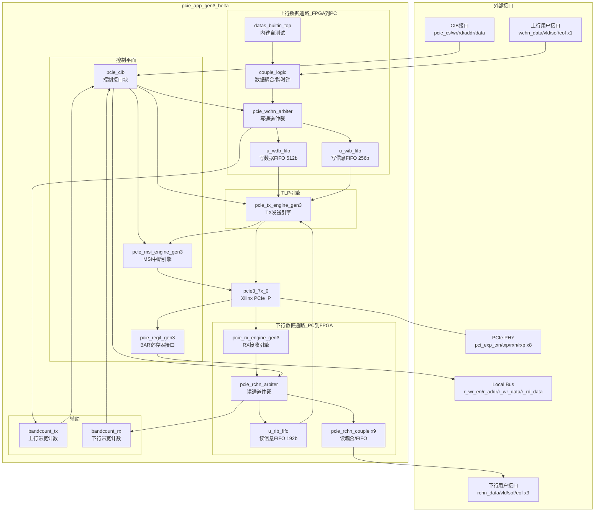
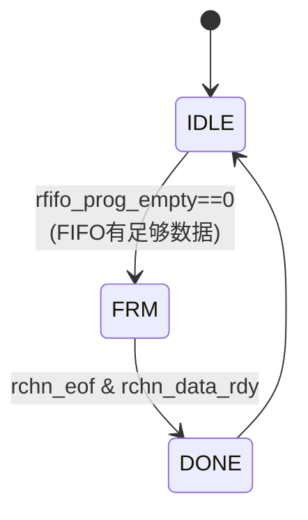
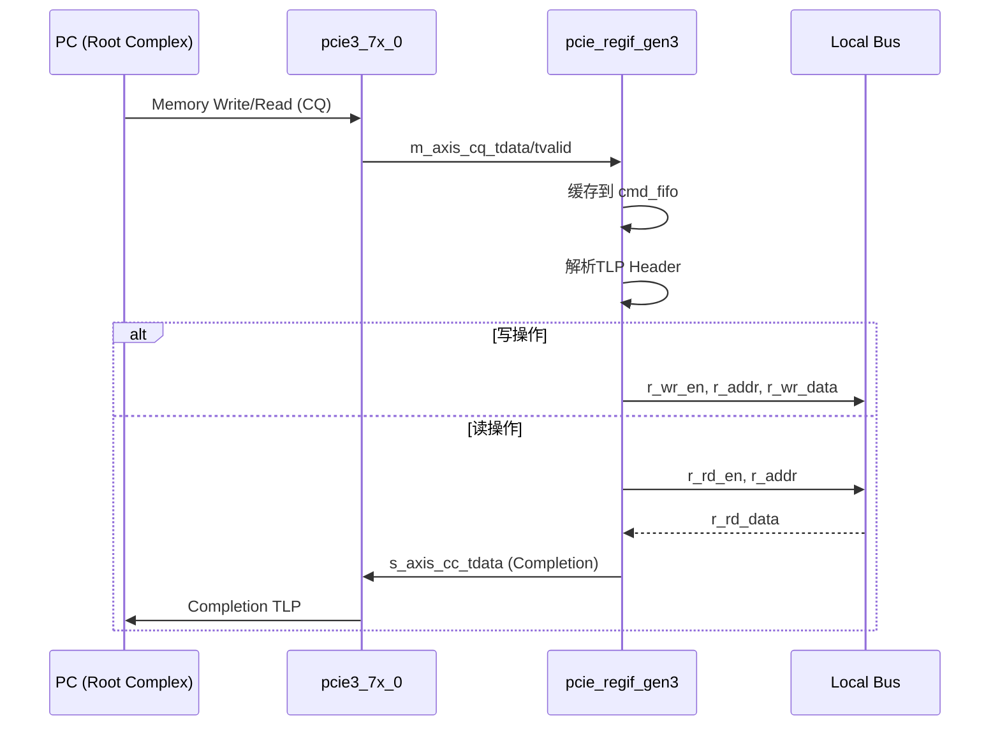
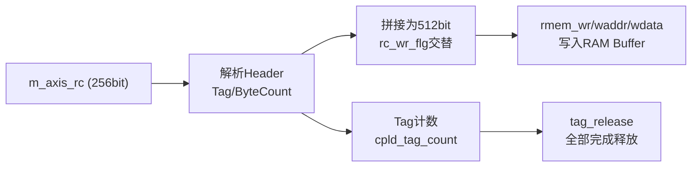
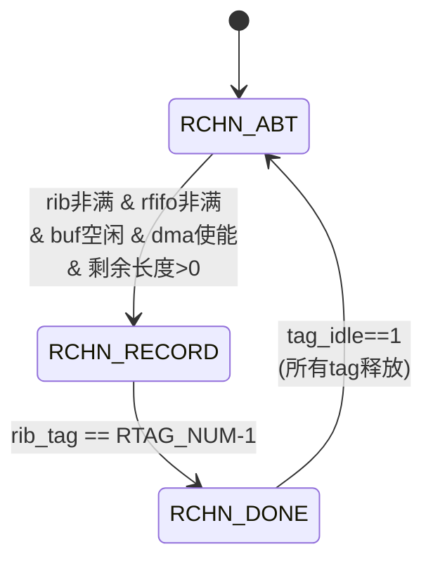
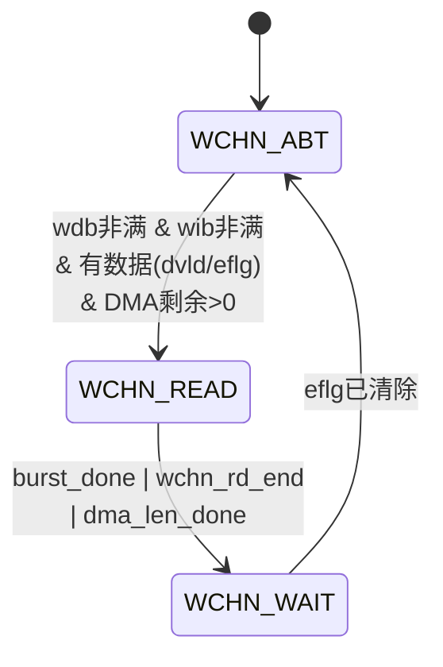
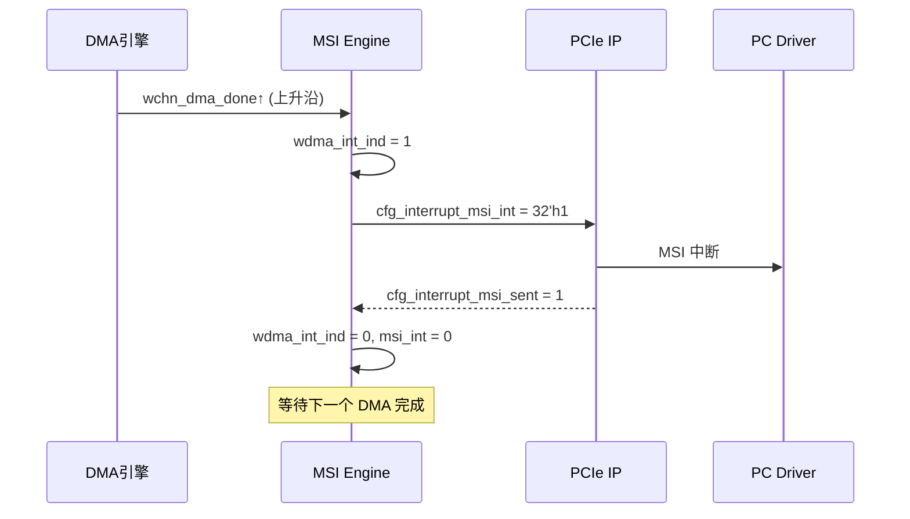

# PCIe Gen3 DMA 引擎顶层模块架构分析

> [!NOTE]
> 本文档针对 `pcie_app_gen3_belta.v` 模块进行完整的架构梳理和功能分析，覆盖所有子模块的功能、关键信号及数据流。

---

## 1. 模块概览

| 属性 | 值 |
|---|---|
| 文件 | [pcie_app_gen3_belta.v](file:///c:/Users/18197/Desktop/code/c720/native_ip/pcie_gen3_belta/src/pcie_app_beltaw/pcie_app_gen3_belta.v) |
| 功能 | PCIe Gen3 x8 多通道 DMA 引擎顶层 |
| PCIe IP | Xilinx pcie3_7x_0 (UltraScale 7系列 Gen3 Endpoint) |
| 写通道 (上行 FPGA→PC) | 32路逻辑通道, 1路物理通道 |
| 读通道 (下行 PC→FPGA) | 9路逻辑通道 |
| 数据位宽 | 512-bit (读/写) |
| TLP 最大负载 | 128B / 256B（自适应） |
| 突发长度 | 2048 Bytes |
| Tag 数量 | 16 |

### 1.1 参数定义

| 参数 | 默认值 | 说明 |
|---|---|---|
| `WCHN_NUM` | 32 | 写通道（上行）逻辑通道数 |
| `RCHN_NUM` | 9 | 读通道（下行）逻辑通道数 |
| `WDATA_WIDTH` | 512 | 写数据位宽 (bit) |
| `RDATA_WIDTH` | 512 | 读数据位宽 (bit) |
| `WPHY_NUM` | 1 | 写物理通道数 |
| `RTAG_NUM` | 16 | 读请求 Tag 数量（影响并发读请求数） |
| `RBURST_LEN` | 2048 | 读突发长度 (Bytes) |
| `BURST_LEN` | 2048 | 写突发长度 (Bytes) |
| `U_DLY` | 1 | 仿真延迟(ns) |

---

## 2. 整体架构



---

## 3. 时钟域划分

| 时钟 | 来源 | 使用范围 |
|---|---|---|
| `ref_clk` | PCIe 参考时钟 (100MHz) | 输入给 pcie3_7x_0 |
| `user_clk` | pcie3_7x_0 输出 (~250MHz @ Gen3x8) | TX/RX引擎、BAR寄存器接口、FIFO读侧 |
| `sys_clk` | 外部系统时钟 | CIB、仲裁器、FIFO写侧 |
| `wchn_clk[i]` | 上行用户时钟 | couple_logic 写侧、datas_builtin_top |
| `rchn_clk[j]` | 下行用户时钟 | pcie_rchn_couple 读侧 |

> [!IMPORTANT]
> 跨时钟域通过三组异步FIFO (u_wib_fifo、u_wdb_fifo、u_rib_fifo) 及各通道内部 FIFO 实现安全隔离。所有跨域信号均须经过至少2级寄存器同步。

### 3.1 复位逻辑

```verilog
assign sys_rst_n_x = (sys_rst_n) & (~soft_rst) & (~user_reset);
```

- `sys_rst_n`: 外部系统复位
- `soft_rst`: CIB 软件可控复位
- `user_reset`: PCIe IP 输出的用户侧复位

三者任一有效→系统复位，确保 PCIe Link Down 或软件请求时全局可控。

---

## 4. 子模块详解

### 4.1 couple_logic — 上行数据耦合模块

**文件**: [couple_logic.v](file:///c:/Users/18197/Desktop/code/c720/native_ip/pcie_gen3_belta/src/pcie_app_beltaw/couple_logic.v)

**功能**: 接收用户上行数据流，完成数据位宽适配和跨时钟域转换。支持两种数据源：外部用户数据 和 内建自测试数据（built_in 模式）。

**关键设计**:

| 信号 | 方向 | 说明 |
|---|---|---|
| `wchn_data_rdy` | OUT | 反压信号，通知用户端 FIFO 可接收数据 |
| `wchn_data_vld` | IN | 用户数据有效 |
| `wchn_sof/eof` | IN | 帧起始/结束标志 |
| `wchn_data` | IN | 用户数据 (WDATA_WIDTH bit) |
| `wchn_end` | IN | 数据包结束标志 |
| `wchn_chn` | IN | 通道编号（多路复用时标识源通道）|
| `wchn_length` | IN | 数据长度 (15bit) |
| `built_in` | IN | 内建自测试使能 |
| `ds_rx_data` | IN | 内建测试数据 |
| `wchn_eflg` | OUT | DMA包结束标志（end flag）→通知仲裁器一次传输完成 |
| `wchn_dvld` | OUT | 内部FIFO数据可读（prog_empty取反）|
| `wchn_dout` | OUT | 读出数据 {通道号, 长度, 结束标志, 512bit数据} |
| `cfifo_overflow` | OUT | FIFO溢出指示 |

**数据位宽适配**:
- 当 `WDATA_WIDTH=1024` 时: 将1024bit拆为两个512bit，通过 `wflg0/wflg1` 交替写入FIFO
- 当 `WDATA_WIDTH=512` 时: 直接1:1写入FIFO

**内建测试模式**: 当 `built_in_r[2]=1` 时，数据源切换为 `ds_rx_data`，通道号固定为 `BUILTIN_NUM`，长度固定为 `BURST_LEN`。

**FIFO 打包格式**: `{wchn, wchn_len, wend, wdata}` = `{WCHN_NUM_W, 15, 1, 512}` bits

---

### 4.2 datas_builtin_top — 内建自测试模块

**功能**: 产生测试数据流（递增、PRBS31、静态模式等），用于 PCIe DMA 链路自环测试。支持令牌桶限速。

**关键信号**:

| 信号 | 说明 |
|---|---|
| `ds_data_mode[2:0]` | 数据模式：递增8bit/PRBS31/128bit递增/静态 |
| `ds_tbucket_width` | 令牌桶宽度（速率控制）|
| `ds_tbucket_deepth` | 令牌桶深度 |
| `ds_tx_len_start` | 定长模式启动 |
| `ds_tx_con_start` | 连续模式启动 |
| `check_st` | 数据校验启动 |
| `ds_rx_data[511:0]` | 发送的测试数据 |
| `ds_rx_data_vld` | 测试数据有效 |

---

### 4.3 bandcount — 带宽统计模块

**文件**: [bandcount.v](file:///c:/Users/18197/Desktop/code/c720/native_ip/pcie_gen3_belta/src/pcie_app_beltaw/bandcount.v)

**功能**: 以秒为周期统计数据吞吐量，通过 `rtc_s_flg`（1秒标志）锁存计数值，单位为 KB/s。

**工作原理**:
1. `kbcnt`: 累计 valid 有效时的字节数，每满1024字节（1KB）归零
2. `cnt`: 每 1KB 递增一次，即 cnt 代表 KB 数
3. `band`: 在秒脉冲边沿锁存 cnt 的值 → 输出为 KB/s

**实例化两次**:
- `u_bandcount`: 统计上行（写）带宽，`valid = wdb_wen`
- `u_bandcount_rx`: 统计下行（读）带宽，`valid = |rfifo_wr`

---

### 4.4 pcie_rchn_couple — 下行通道耦合模块

**文件**: [pcie_rchn_couple.v](file:///c:/Users/18197/Desktop/code/c720/native_ip/pcie_gen3_belta/src/pcie_app_beltaw/pcie_rchn_couple.v)

**功能**: 每个读通道的下行输出接口。包含异步FIFO，将系统时钟域的读回数据转为用户时钟域的帧格式数据流。

**状态机**:



**关键信号**:

| 信号 | 说明 |
|---|---|
| `rfifo_wr` | 系统侧写入FIFO |
| `rfifo_wr_data` | 系统侧写入数据 (RDATA_WIDTH) |
| `rfifo_prog_full` | FIFO将满信号（反压上游）|
| `rchn_data_vld` | 用户侧数据有效 |
| `rchn_data_rdy` | 用户侧就绪（反压） |
| `rchn_sof` | 帧起始 |
| `rchn_eof` | 帧结束 |
| `rchn_data` | 读回数据 |
| `rchn_keep` | 字节使能（全1）|
| `rchn_length` | 固定为 RBURST_LEN |
| `rchn_cnt` | 接收字节计数（调试用）|
| `rchn_terr` | 数据校验错误指示 |
| `rfifo_overflow/underflow` | FIFO异常指示 |

**数据校验**: 检测相邻帧数据是否满足递增关系 (`data[n] == data[n-1] + RDATA_WIDTH/32`)，用于测试。

---

### 4.5 pcie_cib — 控制接口块

**文件**: [pcie_cib.v](file:///c:/Users/18197/Desktop/code/c720/native_ip/pcie_gen3_belta/src/pcie_app_beltaw/pcie_cib.v)

**功能**: 中央控制管理模块，通过 CPU 总线接口实现：

1. **DMA 描述符管理**: 通过 `pcie_witem_glb` 和 `pcie_ritem_glb` 管理写/读 DMA 描述符队列
2. **DMA 配置**: 通道使能、目标地址、传输长度、保留字段等
3. **状态监控**: FIFO 状态、错误历史、带宽统计、DMA 完成计数
4. **自测控制**: 内建测试模式、数据模式、令牌桶参数
5. **TLP 大小自适应**: 根据 `cfg_max_payload` 自动设置 TLP size

**寄存器地址空间** (基地址 0x400):

| 地址 | 寄存器 | 功能 |
|---|---|---|
| 0x400+0x00 | DMA_00 | DMA 中断禁止位 |
| 0x400+0x04 | DMA_01 | 测试寄存器 |
| 0x400+0x08 | DMA_02 | 软复位控制 |
| 0x400+0x14 | DMA_05 | DMA 停止控制 |
| 0x400+0x3C | DMA_0F | PCIe 协商宽度/速度 |
| 0x400+0x40 | DMA_10 | Max Payload/Max Read Req |
| 0x400+0x48 | DMA_12 | FIFO状态/溢出历史 |
| 0x400+0x4C | DMA_13 | 状态机/通道状态 |
| 0x400+0x50 | DMA_14 | 错误历史标志位 |
| 0x400+0xA0 | DMA_28 | 上行带宽 (KB/s) |
| 0x400+0xA4 | DMA_29 | 下行带宽 (KB/s) |
| 0x500 | DMA_40 | 内建测试使能 |
| 0x600+ | DMA_80+ | DMA 统计/调试 |
| 0x680+ | DMA_A0+ | 写描述符FIFO读写 |
| 0x6C0+ | DMA_B0+ | 读描述符FIFO读写 |

**子模块**:

#### 4.5.1 pcie_witem_glb — 写DMA描述符全局管理

管理写通道DMA描述符的写入队列和完成队列，支持CPU直接写入描述符和读取完成状态。

#### 4.5.2 pcie_ritem_glb — 读DMA描述符全局管理

管理读通道DMA描述符的写入队列和完成队列，功能与写侧对称。

#### 4.5.3 pcie_item — DMA描述符项

为每个逻辑通道维护DMA描述符：目标地址、长度、保留字。通过仲裁获取描述符并输出使能和参数。

**TLP Size 自适应逻辑**:
```
cfg_max_payload = 3'b000 → TLP Size = 128 Bytes
cfg_max_payload = 3'b001 → TLP Size = 256 Bytes
cfg_max_payload = 3'b010 → TLP Size = 256 Bytes (限制最大256)
```

---

### 4.6 pcie_regif_gen3 — BAR 寄存器接口

**文件**: [pcie_regif_gen3.v](file:///c:/Users/18197/Desktop/code/c720/native_ip/pcie_gen3_belta/src/pcie_app_beltaw/pcie_regif_gen3.v)

**功能**: 处理 PCIe BAR0 空间的 Memory Read/Write 请求，实现 PC 端对 FPGA 寄存器的读写访问。

**数据流**:



**TLP Header 解析** (CQ 格式):

| 字段 | 位域 | 说明 |
|---|---|---|
| `req_addr` | `[9:2]` | 请求地址 |
| `req_type` | `[75]` | 0=读, 1=写 |
| `req_id` | `[95:80]` | 请求者ID |
| `req_tag` | `[103:96]` | 请求Tag |
| `req_data` | `[159:128]` | 写数据 |
| `BAR index` | `[114:112]` | BAR编号 |

**错误检测**:
- `err_type`: 请求类型错（非 Memory R/W）
- `err_bar`: BAR 不匹配（非 BAR0）
- `err_len`: DWord Count ≠ 1（仅支持单DW操作）

---

### 4.7 pcie_rx_engine_gen3 — RX 接收引擎

**文件**: [pcie_rx_engine_gen3.v](file:///c:/Users/18197/Desktop/code/c720/native_ip/pcie_gen3_belta/src/pcie_app_beltaw/pcie_rx_engine_gen3.v)

**功能**: 处理来自 PCIe IP 的 Requester Completion (RC) 包，即读请求的返回数据，将其写入内部 RAM 缓冲区。

**数据路径**:



**关键信号**:

| 信号 | 说明 |
|---|---|
| `m_axis_rc_tdata[255:0]` | 接收完成包数据 |
| `rc_sof` | 完成包起始 (tuser[32]) |
| `rc_tag_x[4:0]` | 完成包Tag编号 |
| `byte_count[11:0]` | 字节计数 |
| `rmem_wr` | RAM 写使能 |
| `rmem_waddr[7:0]` | RAM 写地址（由 Tag 和 offset 编码）|
| `rmem_wdata[511:0]` | 拼接后的 512bit 写数据 |
| `cpld_tag_count` | Tag 完成位图（每个Tag完成时置1）|
| `tag_release` | 所有 Tag 完成且 RAM 写满→释放标志 |
| `rc_is_err` | 完成包状态错误 |
| `rc_is_fail` | 完成包请求失败 |

**256→512 数据拼接**: 通过 `rc_wr_flg` 交替，每两个256bit RC数据拼接为一个512bit写入 RAM。

**Tag 管理**: 当所有 RTAG_NUM 个 Tag 的完成包都收到（`&cpld_tag_count==1`）且 RAM 地址达到预期，生成 `tag_release` 脉冲。

---

### 4.8 pcie_rchn_arbiter — 读通道仲裁器

**文件**: [pcie_rchn_arbiter.v](file:///c:/Users/18197/Desktop/code/c720/native_ip/pcie_gen3_belta/src/pcie_app_beltaw/pcie_rchn_arbiter.v)

**功能**: 管理多个读通道的 DMA 请求仲裁，生成读请求信息写入 RIB FIFO，并将读回数据分发到各通道的 RFIFO。

**三级状态机**:



**关键设计 — 双缓冲机制**:

仲裁器使用 **双缓冲** (`buf_state[0:1]`) 实现读请求发出和数据接收的流水:
- `BUF_IDLE`: 缓冲区空闲，可接受新请求
- `BUF_ABT`: 缓冲区已分配，正在等待数据返回
- `BUF_RDY`: 数据已全部返回到 RAM Buffer

**数据分发状态机** (D_IDLE → D_FRM → D_WAIT):
- `D_IDLE`: 等待某个缓冲区就绪
- `D_FRM`: 从RAM Buffer读数据，写入目标通道的 rfifo
- `D_WAIT`: 读完一个缓冲区，切换索引

**RIB FIFO 数据格式** (192-bit):

| 位域 | 字段 | 说明 |
|---|---|---|
| [31:0] | `rchn_dma_paddr` | PCIe 侧 DMA 地址（低32位）|
| [41:32] | `rdma_tlp_size` | TLP 大小 |
| [49:42] | `rchn_cnt` | 通道编号 |
| [62:50] | `rib_tag` | Tag 编号 |
| [63] | `rchn_done` | DMA 完成标志 |
| [127:64] | `rchn_dma_prev` | 保留字段/描述符 |
| [159:128] | `rchn_dma_daddr` | 目标地址（低32位）|
| [191:160] | `rchn_dma_daddr_h` | 目标地址（高32位）|

**内部 RAM Buffer**:
- 512bit × 512 深度的双端口 RAM
- `mem_waddr = {buf_wr_index, rmem_waddr}` — 写地址由缓冲索引和RX引擎地址组合
- `mem_raddr = {buf_rd_index, rmem_raddr}` — 读地址由缓冲索引和分发地址组合

---

### 4.9 pcie_wchn_arbiter — 写通道仲裁器

**文件**: [pcie_wchn_arbiter.v](file:///c:/Users/18197/Desktop/code/c720/native_ip/pcie_gen3_belta/src/pcie_app_beltaw/pcie_wchn_arbiter.v)

**功能**: 轮询多个物理通道的 couple_logic FIFO，从中读取上行数据，按 TLP 大小分割后写入 WDB（数据FIFO）和 WIB（信息FIFO）。

**状态机**:



**关键信号**:

| 信号 | 说明 |
|---|---|
| `wchn_dvld[i]` | 物理通道i有数据可读 |
| `wchn_eflg[i]` | 物理通道i一包结束标志 |
| `wchn_eflg_clr[i]` | 清除结束标志 |
| `wchn_ren[i]` | 读使能 |
| `wchn_dout` | 读出数据 {通道号, 长度, end, 512bit数据} |
| `wdb_wen/wdb_din` | 写入数据FIFO |
| `wib_wen/wib_din` | 写入信息FIFO |
| `wchn_len_done` | 通知CIB某通道DMA长度消耗完 |
| `wchn_len_chn` | 完成通道编号 |
| `burst_done` | 一次突发传输完成 |
| `wchn_index` | 从 FIFO 数据中提取的逻辑通道号 |

**WIB FIFO 数据格式** (256-bit):

| 位域 | 字段 |
|---|---|
| [31:0] | `wchn_dma_paddr` — PCIe DMA 地址 |
| [95:32] | `wchn_dma_prev` — 描述符保留字段 |
| [119:96] | `wchn_dma_plen` — 累计传输长度 |
| [151:120] | `wchn_dma_daddr` — 目标地址低 |
| [161:152] | `wtlp_real_cnt` — TLP实际大小 |
| [162] | `wchn_done` — 长度传完标志 |
| [163] | `wchn_rd_end` — 数据包结束标志 |
| [195:164] | `wchn_dma_daddr_h` — 目标地址高 |
| [196+:WCHN_NUM_W] | `wchn_cnt` — 通道编号 |

---

### 4.10 pcie_tx_engine_gen3 — TX 发送引擎

**文件**: [pcie_tx_engine_gen3.v](file:///c:/Users/18197/Desktop/code/c720/native_ip/pcie_gen3_belta/src/pcie_app_beltaw/pcie_tx_engine_gen3.v)

**功能**: 从 WIB/WDB/RIB FIFO 读取数据，组装 RQ (Requester Request) TLP 包，通过 `s_axis_rq` 接口发送到 PCIe IP。支持 Memory Write (MWr) 和 Memory Read (MRd) 两种 TLP。

**MWr/MRd 仲裁**:

```
last_flg 交替标志:
  0 → 优先尝试 MRd (若 rib 有数据)
  1 → 优先尝试 MWr (若 wib+wdb 有数据)

mwr_st_x = (abt & last_flg=1 & wib非空 & wdb非空) 
         | (abt & last_flg=0 & rib空 & wib非空 & wdb非空)

mrd_st_x = (abt & last_flg=0 & rib非空)
         | (abt & last_flg=1 & rib非空 & (wib空|wdb空))
```

> [!TIP]
> 通过 `last_flg` 实现读写交替调度：上一次是读→优先写，上一次是写→优先读，避免带宽饥饿。

**MWr TLP 组装**:

```
Cycle 0: {dout_0_x[127:0], mwr_header_dw3, dw2, dw1, dw0}  — Header + 128bit数据
Cycle 1-N: {dout_2, dout_1} 或 {dout_0_x, dout_3}           — 纯数据
Last Cycle: tkeep=8'h0f, tlast=1
```

**MRd TLP 组装** (单周期):
```
{128'b0, mrd_header_dw3, dw2, dw1, dw0}  — 仅 Header，无数据
tkeep=8'h0f, tlast=1
```

**DMA 完成通知**:

- `wchn_dma_done`: 当 WIB 读出的信息包含 `done`(bit162) 或 `end`(bit163) 标志时置1，持续16个周期后自动清除
- `rchn_dma_done`: 当 RIB 读出的信息包含 `rchn_done`(bit63) 标志时置1

**FIFO 异常检测**:
- `wdb_underflow`: 读空 WDB FIFO
- `txfifo_abnormal_rst`: 当 WIB 和 WDB 不同步（一空一非空）持续超过 250×1000×1000 个周期（约1秒），自动复位两个 FIFO
- `trabt_err`: MWr 和 MRd 同时处于活跃状态（不应发生）

---

### 4.11 pcie_msi_engine_gen3 — MSI 中断引擎

**文件**: [pcie_msi_engine_gen3.v](file:///c:/Users/18197/Desktop/code/c720/native_ip/pcie_gen3_belta/src/pcie_app_beltaw/pcie_msi_engine_gen3.v)

**功能**: 将写/读 DMA 完成事件转换为 MSI 中断请求，通知 PC 端驱动程序。

**工作流程**:



**关键信号**:

| 信号 | 说明 |
|---|---|
| `wdma_int_dis` | 写DMA中断禁止（CIB控制）|
| `rdma_int_dis` | 读DMA中断禁止（CIB控制）|
| `wdma_int_ind` | 写DMA中断待发标志 |
| `rdma_int_ind` | 读DMA中断待发标志 |
| `cfg_interrupt_msi_int` | MSI中断向量（只使用 bit0）|
| `cfg_interrupt_msi_sent` | PCIe IP 确认 MSI 已发送 |
| `cfg_interrupt_msi_fail` | MSI 发送失败 |

---

### 4.12 pcie3_7x_0 — Xilinx PCIe Gen3 IP Core

**功能**: Xilinx 7系列 PCIe Gen3 Endpoint IP，提供 AXI-Stream 接口。

**AXI-Stream 接口**:

| 接口 | 方向 | 功能 |
|---|---|---|
| `s_axis_rq` (256bit) | FPGA→IP | Requester Request（MWr/MRd TLP发送）|
| `m_axis_rc` (256bit) | IP→FPGA | Requester Completion（读返回数据）|
| `m_axis_cq` (256bit) | IP→FPGA | Completer Request（主机读写BAR空间）|
| `s_axis_cc` (256bit) | FPGA→IP | Completer Completion（BAR读返回数据）|

**配置输出**:

| 信号 | 说明 |
|---|---|
| `user_clk` | 用户时钟 |
| `user_reset` | 用户复位 |
| `user_lnk_up` | 链路建立指示 → `pcie_link` |
| `cfg_negotiated_width[3:0]` | 协商链路宽度 (8=x8) |
| `cfg_current_speed[2:0]` | 当前速率 (3=Gen3) |
| `cfg_max_payload[2:0]` | 最大 Payload |
| `cfg_max_read_req[2:0]` | 最大读请求大小 |
| `cfg_interrupt_msi_enable` | MSI 使能 |

---

## 5. 跨时钟域 FIFO 缓冲器

### 5.1 u_rib_fifo — 读信息FIFO

| 参数 | 值 |
|---|---|
| 数据宽度 | 192 bit |
| 深度 | 64 |
| 写时钟 | sys_clk |
| 读时钟 | user_clk |
| prog_full 阈值 | 32 |
| 功能 | 传递读请求描述信息（地址、Tag、TLP大小等）|

### 5.2 u_wib_fifo — 写信息FIFO

| 参数 | 值 |
|---|---|
| 数据宽度 | 256 bit |
| 深度 | 128 |
| 写时钟 | sys_clk |
| 读时钟 | user_clk |
| prog_full 阈值 | 64 |
| 功能 | 传递写TLP描述信息（地址、通道号、长度等）|

### 5.3 u_wdb_fifo — 写数据FIFO

| 参数 | 值 |
|---|---|
| 数据宽度 | 512 bit |
| 深度 | 512 |
| 写时钟 | sys_clk |
| 读时钟 | user_clk |
| prog_full 阈值 | 128 |
| 功能 | 缓存待发送的上行DMA数据负载 |

> [!WARNING]
> WIB 和 WDB 必须同步进出数据。若两者出现一空一非空的不一致状态且持续超过约1秒，TX Engine 会通过 `txfifo_abnormal_rst` 强制复位两个 FIFO，这是一种保护机制。

---

## 6. 完整数据流

### 6.1 上行写 DMA 数据流 (FPGA → PC)

```
用户数据源
    │
    ▼
couple_logic (位宽适配 + 跨时钟域 FIFO)
    │  wchn_dout {通道号, 长度, end, 512bit数据}
    ▼
pcie_wchn_arbiter (轮询仲裁 + TLP分割)
    ├─▶ WDB FIFO (512bit 数据负载)  ────┐
    │                                    ├──▶ pcie_tx_engine_gen3
    └─▶ WIB FIFO (256bit 描述信息)  ────┘     │
                                               │  s_axis_rq → MWr TLP
                                               ▼
                                         pcie3_7x_0 → PCIe PHY → PC
```

### 6.2 下行读 DMA 数据流 (PC → FPGA)

```
                    pcie_cib (DMA描述符)
                        │  rchn_dma_en/addr/len
                        ▼
                pcie_rchn_arbiter
                    │  生成 RTAG_NUM 个读请求
                    ├─▶ RIB FIFO (192bit)  ──▶  pcie_tx_engine_gen3
                    │                              │  s_axis_rq → MRd TLP
                    │                              ▼
                    │                        pcie3_7x_0 → PCIe PHY → PC
                    │
                    │   PC发回 Completion TLP
                    │         │
                    │         ▼
                    │   pcie_rx_engine_gen3 (解析RC包, 写入RAM Buffer)
                    │         │  rmem_wr/waddr/wdata
                    │         ▼
                    │   [内部双端口RAM 512×512]
                    │         │  rmem_rdata
                    │         ▼
                    └── 数据分发到 rfifo_wr[j]
                              │
                              ▼
                    pcie_rchn_couple[0..8] (FIFO + 帧格式化)
                              │
                              ▼
                        用户下行接口 rchn_data/vld/sof/eof
```

### 6.3 BAR 寄存器访问数据流

```
PC (主机端)
    │  Memory Write/Read → CQ TLP
    ▼
pcie3_7x_0 → m_axis_cq
    │
    ▼
pcie_regif_gen3
    │  解析地址/类型/数据
    ├──写──▶ r_wr_en, r_addr, r_wr_data → Local Bus → CIB
    │
    └──读──▶ r_rd_en, r_addr → Local Bus → CIB
              CIB →  r_rd_data → pcie_regif_gen3
                     → s_axis_cc → Completion TLP → PC
```

---

## 7. 关键设计要点总结

### 7.1 多通道DMA架构

- **32路写逻辑通道 + 1路物理通道**: 通过 couple_logic 内 FIFO 的通道号标签实现多路复用
- **9路读逻辑通道**: 每路有独立的 RFIFO，仲裁器按轮询分配读请求
- **描述符队列管理**: 通过 pcie_item + pcie_witem_glb/pcie_ritem_glb 实现硬件描述符队列

### 7.2 性能优化

- **双缓冲读数据**: rchn_arbiter 使用双 buffer 实现读请求和数据接收的流水
- **读写交替调度**: TX Engine 通过 last_flg 避免读或写方向带宽饥饿
- **Token Bucket 限速**: 内建测试支持令牌桶精确控速

### 7.3 可靠性保护

- **FIFO 异常检测与自恢复**: WIB/WDB 不一致超1秒自动复位
- **溢出/欠流监控**: 各级 FIFO 均有 overflow/underflow 历史记录
- **错误上报**: BAR类型错误、Completion错误、Tag管理异常等均可通过 CIB 寄存器查询
- **软复位支持**: 通过 CIB 寄存器实现不重启 PCIe Link 的逻辑复位

### 7.4 调试支持

- `band / rx_band`: 实时上行/下行带宽 (KB/s)
- `t_wchn_cur_st / t_rchn_cur_st`: 写/读仲裁器状态机当前状态
- `wchn_dma_en_cnt / wchn_dma_done_cnt`: DMA 启动/完成计数
- `rchn_terr`: 读数据校验错误标志
- 多处 `mark_debug` 信号可直接接入 ILA

---

## 8. 模块文件清单

| 文件 | 模块 | 功能概述 |
|---|---|---|
| [pcie_app_gen3_belta.v](file:///c:/Users/18197/Desktop/code/c720/native_ip/pcie_gen3_belta/src/pcie_app_beltaw/pcie_app_gen3_belta.v) | 顶层 | PCIe DMA 引擎顶层集成 |
| [couple_logic.v](file:///c:/Users/18197/Desktop/code/c720/native_ip/pcie_gen3_belta/src/pcie_app_beltaw/couple_logic.v) | couple_logic | 上行数据耦合/跨时钟域 |
| [pcie_wchn_arbiter.v](file:///c:/Users/18197/Desktop/code/c720/native_ip/pcie_gen3_belta/src/pcie_app_beltaw/pcie_wchn_arbiter.v) | pcie_wchn_arbiter | 写通道仲裁器 |
| [pcie_rchn_arbiter.v](file:///c:/Users/18197/Desktop/code/c720/native_ip/pcie_gen3_belta/src/pcie_app_beltaw/pcie_rchn_arbiter.v) | pcie_rchn_arbiter | 读通道仲裁器 |
| [pcie_rchn_couple.v](file:///c:/Users/18197/Desktop/code/c720/native_ip/pcie_gen3_belta/src/pcie_app_beltaw/pcie_rchn_couple.v) | pcie_rchn_couple | 下行通道耦合/FIFO |
| [pcie_tx_engine_gen3.v](file:///c:/Users/18197/Desktop/code/c720/native_ip/pcie_gen3_belta/src/pcie_app_beltaw/pcie_tx_engine_gen3.v) | pcie_tx_engine_gen3 | TX TLP 发送引擎 |
| [pcie_rx_engine_gen3.v](file:///c:/Users/18197/Desktop/code/c720/native_ip/pcie_gen3_belta/src/pcie_app_beltaw/pcie_rx_engine_gen3.v) | pcie_rx_engine_gen3 | RX Completion 接收引擎 |
| [pcie_regif_gen3.v](file:///c:/Users/18197/Desktop/code/c720/native_ip/pcie_gen3_belta/src/pcie_app_beltaw/pcie_regif_gen3.v) | pcie_regif_gen3 | BAR0 寄存器接口 |
| [pcie_cib.v](file:///c:/Users/18197/Desktop/code/c720/native_ip/pcie_gen3_belta/src/pcie_app_beltaw/pcie_cib.v) | pcie_cib | 控制接口块 (中央管理) |
| [pcie_msi_engine_gen3.v](file:///c:/Users/18197/Desktop/code/c720/native_ip/pcie_gen3_belta/src/pcie_app_beltaw/pcie_msi_engine_gen3.v) | pcie_msi_engine_gen3 | MSI 中断引擎 |
| [bandcount.v](file:///c:/Users/18197/Desktop/code/c720/native_ip/pcie_gen3_belta/src/pcie_app_beltaw/bandcount.v) | bandcount | 带宽统计 |
| [asyn_fifo.v](file:///c:/Users/18197/Desktop/code/c720/native_ip/pcie_gen3_belta/src/pcie_app_beltaw/asyn_fifo.v) | asyn_fifo | 异步FIFO |
| [pcie_item.v](file:///c:/Users/18197/Desktop/code/c720/native_ip/pcie_gen3_belta/src/pcie_app_beltaw/pcie_item.v) | pcie_item | DMA 描述符项 |
| [pcie_witem_glb.v](file:///c:/Users/18197/Desktop/code/c720/native_ip/pcie_gen3_belta/src/pcie_app_beltaw/pcie_witem_glb.v) | pcie_witem_glb | 写描述符全局管理 |
| [pcie_ritem_glb.v](file:///c:/Users/18197/Desktop/code/c720/native_ip/pcie_gen3_belta/src/pcie_app_beltaw/pcie_ritem_glb.v) | pcie_ritem_glb | 读描述符全局管理 |
| [pcie3_7x_0_stub.v](file:///c:/Users/18197/Desktop/code/c720/native_ip/pcie_gen3_belta/src/pcie_app_beltaw/pcie3_7x_0_stub.v) | pcie3_7x_0 | Xilinx PCIe IP 接口定义 |
