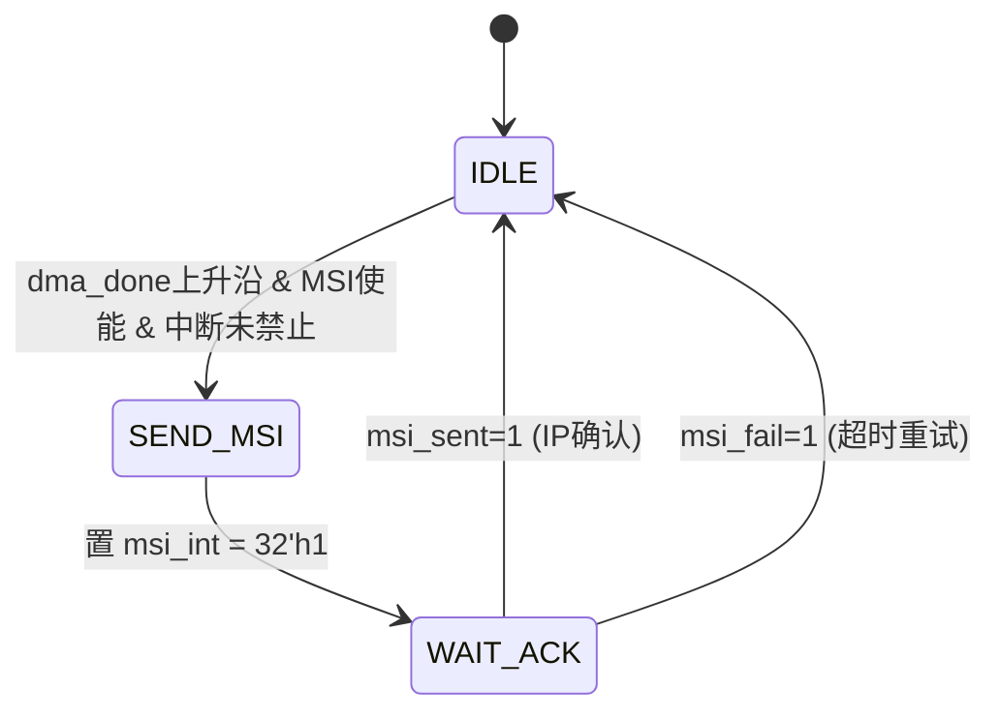
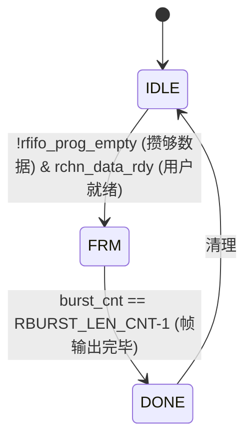
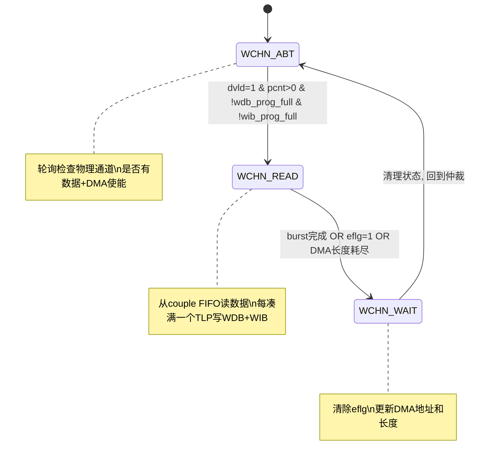
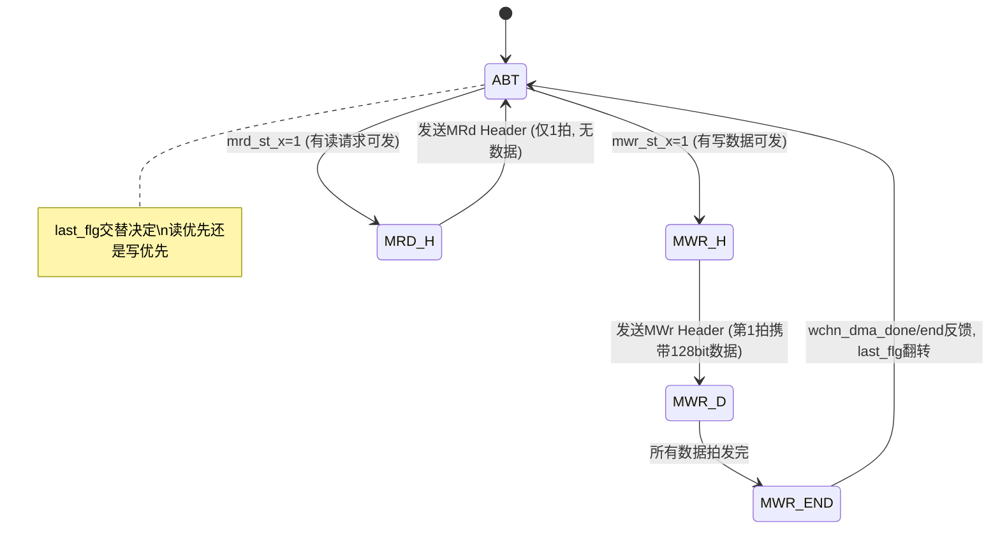

# PCIe DMA 引擎进阶学习 — 子模块深入

> [!NOTE]
> 本文档是学习指南的 **进阶篇**，按推荐阅读顺序逐个深入每个子模块的状态机和关键逻辑。
> 建议配合源代码阅读，每学完一个模块，在代码中找到对应的逻辑验证理解。

---

## 模块1: bandcount — 带宽统计 (最简单，入门热身)

📄 [bandcount.v](file:///c:/Users/18197/Desktop/code/c720/native_ip/pcie_gen3_belta/src/pcie_app_beltaw/bandcount.v)

### 核心逻辑 (仅~30行有效代码)

```
原理: 每个时钟周期如果 valid=1, 累加 DATAW/8 字节
      每秒(rtc_s_flg 上升沿)锁存累计值, 然后清零

时序:
  rtc_s_flg ──┐                  ┌──
              └──────────────────┘
  counter     0→64→128→...→N      0→64→...
  band        旧值                N (KB/s)
```

### 关键代码

```verilog
always @(posedge clk)
begin
    if(valid)
        cnt <= cnt + DATAW/8;    // 每拍 64字节(当DATAW=512)
    
    if(rtc_s_flg_posedge)
    begin
        band <= cnt >> 10;       // 除1024 → 单位从Byte变为KB
        cnt  <= 0;
    end
end
```

> **学到了什么**: 用秒脉冲采样计数器是监控系统吞吐量的经典方法。

---

## 模块2: pcie_msi_engine_gen3 — MSI 中断引擎

📄 [pcie_msi_engine_gen3.v](file:///c:/Users/18197/Desktop/code/c720/native_ip/pcie_gen3_belta/src/pcie_app_beltaw/pcie_msi_engine_gen3.v)

### 状态机



### 关键信号交互

```
tx_engine                msi_engine                 PCIe IP
    │                        │                          │
    │──wchn_dma_done=1──────→│                          │
    │                        │──cfg_interrupt_msi_int──→│
    │                        │   = 32'h0000_0001        │
    │                        │                          │
    │                        │←─cfg_interrupt_msi_sent──│ (中断已发出)
    │                        │   清除 msi_int = 0       │
```

### 思考题

> 如果 `wdma_int_dis=1`（中断禁止），DMA 完成事件会怎样？
> 答：`dma_done` 信号仍然会产生，只是 MSI 引擎不发送中断。PC 驱动只能通过轮询 CIB 寄存器来发现 DMA 完成。

---

## 模块3: couple_logic — 上行数据耦合

📄 [couple_logic.v](file:///c:/Users/18197/Desktop/code/c720/native_ip/pcie_gen3_belta/src/pcie_app_beltaw/couple_logic.v)

### 数据流图

```
wchn_clk 域                              sys_clk 域
┌──────────────────┐                   ┌──────────────┐
│ 用户数据          │                   │ wchn_arbiter │
│  wchn_data(512)  │                   │              │
│  wchn_chn (5)    │  ┌──────────────┐ │  wchn_ren ──→│
│  wchn_length(15) │→ │  异步FIFO    │→│←── wchn_dvld │
│  wchn_end  (1)   │  │ 533bit×深度  │ │  wchn_dout ──│→ 仲裁器解包
│  wchn_vld        │  └──────────────┘ │              │
│  OR              │                   │  wchn_eflg ──│→ 包结束通知
│  ds_rx_data(512) │                   │              │
│  (内建测试数据)   │                   └──────────────┘
└──────────────────┘
```

### FIFO 打包格式 (533bit)

```
┌─────────┬────────┬─────┬────────────────────┐
│ wchn_chn│ length │ end │      data          │
│  5bit   │ 15bit  │ 1bit│     512bit         │
└─────────┴────────┴─────┴────────────────────┘
   MSB                                      LSB
```

### Built-in 切换逻辑

```verilog
// 核心: MUX选择数据源
if(built_in_r[2] == 1'b0)        // 正常模式
    wdata <= wchn_data;           // 使用用户数据
else                              // 内建测试模式
    wdata <= ds_rx_data;          // 使用测试数据

// 注意: built_in_r[2] 是打了3拍的同步信号(CDC)
```

> **学到了什么**: FIFO的"打包"设计模式——把控制信息和数据一起打包进FIFO，读出后解包，避免了额外的控制路径。

---

## 模块4: pcie_rchn_couple — 下行数据输出

📄 [pcie_rchn_couple.v](file:///c:/Users/18197/Desktop/code/c720/native_ip/pcie_gen3_belta/src/pcie_app_beltaw/pcie_rchn_couple.v)

### 状态机



### 帧输出时序

```
           ┌──┐  ┌──┐  ┌──┐  ┌──┐  ┌──┐  ┌──┐  ┌──┐
rchn_clk  ─┘  └──┘  └──┘  └──┘  └──┘  └──┘  └──┘  └──
                ________________________________
data_vld  ─────┘                                └─────
           ___
sof       ─┘ └────────────────────────────────────────  第1拍
                                            ___
eof       ──────────────────────────────────┘ └───────  最后1拍
           ┌───┬───┬───┬───┬───┬───┬───┬───┐
data      ─┤D0 │D1 │D2 │...│...│...│Dn-1│Dn│─────── 每拍512bit
           └───┴───┴───┴───┴───┴───┴───┴───┘

一帧 = RBURST_LEN/64 = 2048/64 = 32拍
```

### prog_empty 阈值的关键作用

```verilog
// rchn_couple 不是一有数据就输出, 而是等攒够一帧(32拍)才开始
// 这由 rfifo_prog_empty 控制:
//   prog_empty_thresh = RBURST_LEN/(RDATA_WIDTH/8) = 2048/64 = 32
//   当 FIFO 中数据 >= 32 个时: prog_empty=0 → 可以输出
//   当 FIFO 中数据 <  32 个时: prog_empty=1 → 等待
```

> **学到了什么**: `prog_empty`/`prog_full` 是异步FIFO最重要的流控手段。比简单的 `empty`/`full` 提供了更灵活的控制——可以设定"攒够N个再开始"。

---

## 模块5: pcie_regif_gen3 — BAR0 寄存器接口

📄 [pcie_regif_gen3.v](file:///c:/Users/18197/Desktop/code/c720/native_ip/pcie_gen3_belta/src/pcie_app_beltaw/pcie_regif_gen3.v)

### CQ → local_bus 解析流程

```
PC: iowrite32(BAR0 + 0x400, 0x12345678)
                    │
                    ↓
    ┌─────────────────────────────┐
    │ pcie3_7x_0 生成 CQ TLP     │
    │ tdata[31:0]  = BAR0偏移地址│  → r_addr = 0x400 >> 2 = 0x100
    │ tdata[10:0]  = DWord计数   │  → 必须=1 (只支持单DW操作)
    │ tdata[14:11] = 请求类型    │  → 0001=MWr / 0000=MRd
    │ tdata[114:112]= BAR编号    │  → 必须=0 (BAR0)
    │ tdata[159:128]= 写数据     │  → r_wr_data = 0x12345678
    └─────────────────────────────┘
```

### 状态机

```
CQ_IDLE → CQ_PARSE: tvalid=1 (收到CQ TLP)
CQ_PARSE → CQ_WRITE: 是写请求 → 输出 r_wr_en + r_addr + r_wr_data
CQ_PARSE → CQ_READ:  是读请求 → 输出 r_rd_en + r_addr, 等待 r_rd_data
CQ_READ → CC_SEND:   r_rd_data 就绪 → 组装 CC TLP 返回
CC_SEND → CQ_IDLE:   CC 发送完毕
```

### 错误检测

```verilog
assign err_type_l = (req_type != 4'b0001 && req_type != 4'b0000);  // 非MWr/MRd
assign err_bar_l  = (bar_id != 3'b000);                             // 非BAR0
assign err_len_l  = (dword_count != 11'd1);                         // 非单DW
```

> **学到了什么**: PCIe BAR访问的TLP格式，以及为什么只支持单DW(32bit)操作——因为CPU的 `iowrite32` 每次只写4字节。

---

## 模块6: pcie_rx_engine_gen3 — Completion 接收

📄 [pcie_rx_engine_gen3.v](file:///c:/Users/18197/Desktop/code/c720/native_ip/pcie_gen3_belta/src/pcie_app_beltaw/pcie_rx_engine_gen3.v)

### 256bit → 512bit 拼接时序 (核心难点)

```
RC AXI-Stream 格式 (Xilinx Gen3, 256bit):
  
第1拍(SOF):
  [31:0]   = {addr_low}                    ← 寻址信息(未用)
  [42:32]  = byte_count                    ← 本Completion的字节数  
  [63:43]  = {req_id, ...}                 ← 请求者信息
  [71:64]  = tag                           ← ★关键: 标识哪个请求的返回
  [95:72]  = {attr, tc, completer_id}      
  [255:96] = data[159:0]                   ← 前160bit数据

第2拍:
  [255:0]  = data续接                       ← 256bit数据

拼接过程:
  暂存区: rc_data_reg[159:0] ← tdata[255:96]  (每拍暂存160bit)
  拼接:   rc_wdata[255:0]   ← {rc_data_reg[159:0], tdata[95:0]}

  rc_wr_flg 交替:
    flg=0: rmem_wdata[255:0]   ← rc_wdata    (低半)
    flg=1: rmem_wdata[511:256] ← rc_wdata    (高半) → rmem_wr=1 写RAM
```

### Tag 位图管理

```verilog
// 初始: cpld_tag_count = 16'hFFFF (所有Tag待回收)
// 每收到一个Tag的最后字节: cpld_tag_count[tag] <= 0
// 当 cpld_tag_count == 0: tag_release <= 1 (全部回收完毕)

例子(RTAG_NUM=16):
  初始:   1111_1111_1111_1111  (16个Tag都在等)
  收Tag5: 1111_1111_1101_1111
  收Tag0: 1111_1111_1101_1110
  ...
  全收:   0000_0000_0000_0000 → tag_release!
```

### RAM 地址计算公式

```
rmem_waddr = {Tag编号, 包内偏移}

当 Max Payload = 128B:
  每个Tag占2个512bit slot (128B / 64B = 2)
  rmem_waddr = {2'b0, tag[3:0], offset[0]}
  地址范围: Tag0 = 0x00~0x01, Tag1 = 0x02~0x03, ...

当 Max Payload = 256B:
  每个Tag占4个512bit slot (256B / 64B = 4)
  rmem_waddr = {1'b0, tag[3:0], offset[1:0]}
```

> **学到了什么**: 数据拼接(位宽转换)的标准方法——暂存+拼接+交替写入。Tag位图是管理乱序完成的经典方式。

---

## 模块7: pcie_wchn_arbiter — 写通道仲裁器

📄 [pcie_wchn_arbiter.v](file:///c:/Users/18197/Desktop/code/c720/native_ip/pcie_gen3_belta/src/pcie_app_beltaw/pcie_wchn_arbiter.v)

### 状态机详解



### TLP分片计算

```
假设 wdma_tlp_size = 128字节, 数据位宽 = 512bit = 64字节

一个TLP需要: 128 / 64 = 2 个 512bit 数据
  wtlp_cnt += 64 每拍
  当 wtlp_cnt >= 128-64 = 64 时, TLP满
  → wib_wen=1, 写入地址信息
  → wtlp_cnt 清零
  → wchn_dma_addr += 128 (PC端地址递增一个TLP)
  → wchn_dma_len -= 1 (剩余TLP数减1)
```

### DMA长度与burst的关系

```
DMA 参数:
  wchn_dma_addr = 0x1000_0000  (起始地址)
  wchn_dma_len  = 16           (共16个TLP)
  wdma_tlp_size = 128B         (每个TLP 128字节)
  
  总传输量 = 16 × 128 = 2048 字节 = BURST_LEN

一次仲裁(WCHN_READ)传输 = 1个burst = 2048字节
  包含 2048/128 = 16 个TLP
  每个TLP写1次WIB + 2次WDB(128B/64B=2)
  共: 16×1=16次WIB写, 16×2=32次WDB写
```

> **学到了什么**: 仲裁器的核心职责——把连续的用户数据流切割成固定大小的TLP块，同时维护每个通道的DMA地址和剩余长度。

---

## 模块8: pcie_rchn_arbiter — 读通道仲裁器

📄 [pcie_rchn_arbiter.v](file:///c:/Users/18197/Desktop/code/c720/native_ip/pcie_gen3_belta/src/pcie_app_beltaw/pcie_rchn_arbiter.v)

### 双缓冲状态机

```
buf_state[0] 和 buf_state[1] 各有4个状态:
  00 = EMPTY:   缓冲区空闲
  01 = FILLING: 正在发送MRd请求, 等待数据返回
  10 = READY:   tag_release=1, 数据已全部就绪
  11 = FLUSHING: 正在从RAM读数据写入rfifo

流水化工作:
  时间1: buf0=FILLING(发请求等回复), buf1=EMPTY
  时间2: buf0=READY(数据到了),      buf1=FILLING(接新任务)
  时间3: buf0=FLUSHING(搬数据),     buf1=FILLING(继续等)
  时间4: buf0=EMPTY(搬完),          buf1=READY
```

### RIB 信息格式 (192bit)

```
┌───────────┬───────────┬──────────────────┬──────┬─────┬────────┬──────────┬──────────┐
│addr_high  │addr_low   │rev(保留字)        │done  │tag  │chn_num │tlp_size  │pcie_addr │
│  32bit    │  32bit    │  64bit           │ 1bit │5bit │ 4bit   │ 10bit    │ 32bit    │
└───────────┴───────────┴──────────────────┴──────┴─────┴────────┴──────────┴──────────┘
```

### RFIFO 写入 — 通道选择

```verilog
// rchn_arbiter 将数据从 RAM 读出后, 根据当前通道号选择目标rfifo:
rfifo_wr[j] = (buf_user[current_buf] == j) ? ram_rd_vld : 1'b0;
rfifo_wr_data = ram_rd_data;  // 所有通道共享数据线, 用wr使能选择

// 这就是为什么 rfifo_wr_data 在顶层是一根线连所有通道：
//   .rfifo_wr_data (rfifo_wr_data)  ← 同一根 512bit 数据线
//   .rfifo_wr      (rfifo_wr[j])    ← 每个通道独立的写使能
```

> **学到了什么**: 双缓冲是FPGA中实现流水化的通用模式——一个缓冲区做A动作，另一个做B动作，完了对换角色。

---

## 模块9: pcie_tx_engine_gen3 — TLP 组装

📄 [pcie_tx_engine_gen3.v](file:///c:/Users/18197/Desktop/code/c720/native_ip/pcie_gen3_belta/src/pcie_app_beltaw/pcie_tx_engine_gen3.v)

### 主状态机



### MWr TLP 发送时序 (128B Payload)

```
时钟   拍1(Header+D0)       拍2(D1)            
       ┌──────────────┐     ┌──────────────┐
tdata  │Header[127:0] │     │D1[255:0]     │   
       │D0[255:128]   │     │              │   
       └──────────────┘     └──────────────┘
tlast  │    0         │     │    1         │   128B = 2×256bit - 128bit(Header占)
tkeep  │ 8'hFF        │     │ 8'hFF        │   = 实际需要 Header拍(128data) + 1个完整拍
tvalid │    1         │     │    1         │

Header详细:
  DW0 [31:0]   = wr_dma_addr           // PC端目标地址低32位
  DW1 [63:32]  = wr_dma_addr_h         // PC端目标地址高32位
  DW2 [95:64]  = {16'b0, 1'b0, 4'b0001, 11'd(TLP_SIZE/4)}
                  │              │        └─ DWord计数=32
                  │              └─ req_type=MWr(0001)
                  └─ requester_id(由IP自动填)
  DW3 [127:96] = {属性, TC, Tag}        // MWr的Tag=0(不需要返回)
```

### MRd TLP 发送 (无数据, 仅Header)

```
时钟   拍1(Header only)
       ┌──────────────┐
tdata  │Header[127:0] │   DW2.req_type = 0000 (MRd)
       │Padding       │   DW3.tag = rdma_tag (来自RIB FIFO)
       └──────────────┘
tlast  │    1         │   仅1拍
tkeep  │ 8'h0F        │   只有4个DW有效(128bit Header)
```

### txfifo_abnormal_rst 异常检测原理

```verilog
// 正常: WIB非空 且 WDB非空 (总是成对出现)
// 异常: WIB空 但 WDB非空, 或反之 (信息和数据失步)
// 
// 检测: 持续计数 abnormal_cnt, 超过阈值(~1秒)触发复位
//   if((wib_empty && !wdb_empty) || (!wib_empty && wdb_empty))
//       abnormal_cnt <= abnormal_cnt + 1;
//   else
//       abnormal_cnt <= 0;
//   
//   if(abnormal_cnt > THRESHOLD)
//       txfifo_abnormal_rst <= 1;  // 强制复位 WIB + WDB
```

> **学到了什么**: TLP的精确格式、Header+数据的交织方式、读写公平调度的 `last_flg` 机制。

---

## 模块10: pcie_cib — 中央控制接口块 (最复杂)

📄 [pcie_cib.v](file:///c:/Users/18197/Desktop/code/c720/native_ip/pcie_gen3_belta/src/pcie_app_beltaw/pcie_cib.v)

### 寄存器映射表 (核心)

| 地址 | 名称 | 读/写 | 功能 |
|------|------|-------|------|
| 0x400 | DMA_00 | W | witem_wdata0 写描述符数据0 (目标地址低) |
| 0x404 | DMA_01 | W | witem_wdata1 写描述符数据1 (长度) |
| 0x408 | DMA_02 | W | witem_wdata2 写描述符数据2 (目标地址高) |
| 0x40C | DMA_03 | W | witem_wdata3 写描述符数据3 (保留0) |
| 0x410 | DMA_04 | W | witem_wdata4 写描述符数据4 (保留1) |
| 0x414 | DMA_05 | W | witem_wr_det 写入触发+通道号 |
| 0x430 | DMA_0C | W | ritem_wdata0~4 读描述符 |
| 0x43C | DMA_0F | R | PCIe链路信息 {speed, width, payload} |
| 0x440 | DMA_10 | W | soft_rst 软复位 |
| 0x44C | DMA_13 | R | 状态机状态 {wchn_st, rchn_st} |
| 0x450 | DMA_14 | R | 错误历史寄存器 |
| 0x4A0 | DMA_28 | R | 上行带宽 (KB/s) |
| 0x4A4 | DMA_29 | R | 下行带宽 (KB/s) |

### 描述符传递流程 (详细)

```
PC驱动端:
  iowrite32(BAR0+0x400, 0x10000000);  // DMA_00: 目标地址低
  iowrite32(BAR0+0x404, 16);          // DMA_01: 长度(16个TLP)
  iowrite32(BAR0+0x408, 0x00000000);  // DMA_02: 目标地址高
  iowrite32(BAR0+0x40C, 0x00000000);  // DMA_03: 保留
  iowrite32(BAR0+0x410, 0x00000000);  // DMA_04: 保留
  iowrite32(BAR0+0x414, 0x00000005);  // DMA_05: 触发! bit[4:0]=通道5

FPGA端:
  regif: CQ TLP → local_bus → r_wr_en + r_addr + r_wr_data
  CIB:   检测到 DMA_05 写入 → witem_wr_det 边沿
         pcie_witem_glb: 将 {wdata4,wdata3,...,wdata0} 写入描述符FIFO
         pcie_item[5]:   从FIFO读取描述符
                         输出 wchn_dma_en[5]=1
                         输出 wchn_dma_addr[5]=0x10000000
                         输出 wchn_dma_len[5]=16
  arbiter: 检测到 wchn_dma_en[5] → 开始仲裁为通道5服务
```

### 错误历史寄存器 (DMA_14) 格式

```
bit[0]  = his_wdb_overflow     // WDB FIFO曾经溢出
bit[1]  = his_wib_overflow     // WIB FIFO曾经溢出
bit[2]  = his_wdb_underflow    // WDB FIFO曾经欠流
bit[3]  = his_cfifo_overflow   // couple FIFO曾经溢出
bit[4]  = his_txfifo_abnormal  // TX FIFO曾经异常复位
bit[8]  = his_rc_err           // Completion TLP曾经出错
bit[9]  = his_rc_fail          // Completion TLP曾经失败
bit[16] = his_rfifo_overflow   // RFIFO曾经溢出
bit[17] = his_rfifo_underflow  // RFIFO曾经欠流

★关键: 这些是"粘滞"位 — 一旦置1就不会自动清零
  清除方法: 写 DMA_14 任意值 → 全部清零
  目的: 即使异常只发生1个时钟周期, 也不会被遗漏
```

> **学到了什么**: CIB是整个系统的"神经中枢"——所有配置从这里下发，所有状态在这里汇聚。错误历史寄存器是FPGA调试的必备模式。

---

## 综合练习：跟踪一笔上行 DMA 传输

打开代码，在以下关键点设置 ILA 观察点，跟踪一笔完整传输：

```
观察点1: couple_logic.v
  信号: wvld, wdata, wchn, wend, txdma_fifo_wr
  → 确认用户数据正确进入FIFO

观察点2: pcie_wchn_arbiter.v  
  信号: wchn_dvld, wchn_ren, t_wchn_cur_st, wtlp_cnt, wdb_wen, wib_wen
  → 确认仲裁器正确读取数据并分片

观察点3: pcie_tx_engine_gen3.v (user_clk域)
  信号: wib_empty, wdb_empty, s_axis_rq_tvalid, s_axis_rq_tdata, s_axis_rq_tlast
  → 确认TLP正确组装并发送

观察点4: pcie_msi_engine_gen3.v
  信号: wchn_dma_done, cfg_interrupt_msi_int, cfg_interrupt_msi_sent
  → 确认DMA完成后中断正确发送
```

> [!TIP]
> **调试技巧**: 如果数据丢失，先看 CIB 的 DMA_14(错误历史)，它会告诉你哪个环节出了问题。然后在对应环节加 ILA 深入排查。
